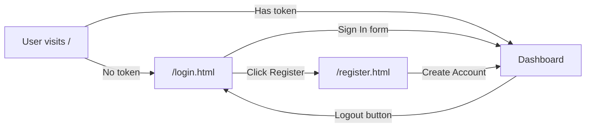

# Phase 2 – Walkthrough

## ✅ What Was Built

### 3 Separate Pages

| URL | File | Purpose |
|-----|------|---------|
| `localhost:3000/login.html` | `login.html` | Dedicated Sign In page |
| `localhost:3000/register.html` | `register.html` | Dedicated Create Account page |
| `localhost:3000/` | `index.html` | Dashboard (protected) |

---

### Login Page (`/login.html`)
````carousel

<!-- slide -->

````

**Login page features:**
- Split layout (left: branding + features, right: form)
- Floating animated logo
- Feature showcase: Analytics, Budget, Debt Splitter, Any Device
- Clean username/password form
- Purple gradient Sign In button with hover effects

**Register page features:**
- Reversed split layout (left: form, right: step guide)
- Password strength indicator (4-bar visual)
- Green gradient theme
- Step-by-step "Get Started" guide on the right panel

### Auth Guards
- **`/login.html`** and **`/register.html`**: Redirect to `/` if user already has a token
- **`/` (dashboard)**: Has a guard script that immediately redirects to `/login.html` if no token is found
- **Logout button** (⏻): Calls the API to invalidate the session, clears localStorage, redirects to `/login.html`

---

## Navigation Flow



---

## Other Features (Also Active)
- **🔔 Notifications** — bell icon in dashboard header shows budget alerts
- **🤖 BuddyBot Chatbot** — floating 🤖 button opens AI assistant
- **💸 Budget Negative Display** — Budget Left shows **-₹X** in red when overspent
- **🤝 Expense Splitting** — Split checkbox in Add Expense auto-creates a debt
- **📱 PWA / Offline** — Installable via service worker
